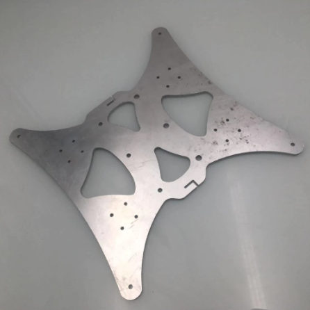

## Modifications  

### Auto bed leveling
Antclabs BL Touch, setup with 3x3 grid test points, double (fast/slow) probing.

### New extruder, fan and hotend assembly
Titan Aero Extruder.  
Aero "Evolve" fan duct [See Thingiverse](https://www.thingiverse.com/thing:3279302) - Modified for direct mounting on linear rails.  
Nickel plated brass Volcano heat block. (Steady temperature after upgrade: Temperature varies only with +/- 0.2 degrees  
Hardened steel nozzle  
Titanium heatbreak  

### Dehydrator with build in filament spool

Custom filament spool gliding on ball bearings.  
Custom dehydrator tray extension with filament guide.

### X Axis linear rails

Mounted on top of 20mm aluminum extrusion, with steel brackets from back.  
Timing belt tensioner, pulley exchanged to 20T with teeth   
Replaced timing belt with fiber reenforced

### Y axis linear rails

  
Dual Hiwin linear rails with two MGN12H carriages on each rail.
Custom made, CNC cut steel gantry plate  
Timing belt tensioner, pulley exchanged to 20T with teeth  
Heatbed mounted on solid aluminum spacers  
Replaced timing belt with fiber reenforced

### Raspberry Pi

Raspberry Pi 4, 4GB, running Octoprint  
Mounted under controlbox with: [See Thingiverse](https://www.thingiverse.com/thing:2838150)  
Extra 120mm fan  
LM2596 StepDown for powering Raspberry Pi from controlbox 24V supply. Mounted in custom housing.  

### Stepper dampeners
Mounted on Y- and X-axis stepper moters

  
## Future plans

### Replace filament sensor
Possibly Big Tree Tech Smart Filament Sensor

### Y axis timing belt tensioner

### Motherboard supporting individual Z-axis stepper motor control

### LED lighting

### Polycarbonate V-slot wheels on Z-axis

### Remove Z-axis mounted breakout PCB

Wiring relocated under printer (standalone mod related.)
PCB emergency repaired several times and failing fast.

### Standalone mod

Move power supply, mainboard, Raspberry Pi and wiring below printer.
